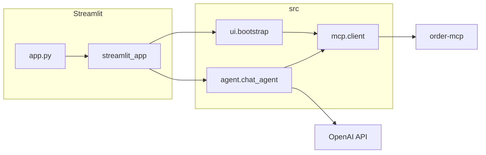

# Meridian Customer Support Chatbot

Streamlit chatbot that answers Meridian Electronics customer questions using **OpenAI tool calling** and the **`order-mcp`** MCP server (inventory, auth, orders).

## Features

- **Product discovery:** `list_products`, `search_products`, `get_product` (with deterministic category icons and description / “More info” lines when MCP text allows)
- **Authentication:** sidebar **email + PIN** → MCP `verify_customer_pin` (no secrets in chat history); optional in-chat tool path still supported by the agent
- **Orders:** `list_orders`, `get_order`, `create_order` (scoped to `verified_customer_id` when the session is verified)

## Architecture

Flow: **Streamlit** (`app.py` → `src/ui/streamlit_app.py`) calls **`prepare_langfuse_env()`**, loads settings, bootstraps **`OrderMCPClient`** + OpenAI tool definitions (`src/ui/bootstrap.py`), builds the OpenAI client via **`create_openai_client()`** (Langfuse-wrapped when Langfuse keys are set), and runs **`run_agent_turn`** (`src/agent/chat_agent.py`). The agent calls **OpenAI** with MCP-backed tools; each **`tools/call`** goes through **`src/mcp/client.py`** (optional Langfuse **tool** spans). Product tool text is enriched (icons, description/link formatting) before it is returned to the model; the final assistant reply can be augmented with icons using recent tool bodies. Session **`verified_customer_id`** (set from sidebar verify) constrains order tools via **`apply_verified_customer_scope`** in `src/agent/tool_policy.py`. Errors surface as **`MCPError`**, **`MCPConnectionError`**, **`MCPClientError`**, or **`LLMProviderError`** (`src/exceptions.py`) and are formatted in **`src/ui/error_presenter.py`**.



Full detail: [documentation/ARCHITECTURE.md](documentation/ARCHITECTURE.md).

## Local setup

```bash
python -m venv .venv
source .venv/bin/activate
pip install -r requirements.txt
export OPENAI_API_KEY=sk-...
streamlit run app.py
```

Copy [.env.example](.env.example) for variable names and defaults. Use Hugging Face **Space secrets** for `OPENAI_API_KEY` in deployment.

## Code layout

| Path | Role |
|------|------|
| `app.py` | Streamlit entrypoint |
| `src/config/` | Settings, prompts, constants, icons |
| `src/mcp/` | MCP JSON-RPC client |
| `src/agent/` | Tool schema, policy, chat loop, product formatting |
| `src/ui/` | Streamlit UI, bootstrap, error copy |
| `src/observability/` | Langfuse env handling, OpenAI client factory, MCP span helper |
| `src/exceptions.py` | Typed errors by layer |

## Docs

| Doc | Purpose |
|-----|---------|
| [ARCHITECTURE.md](documentation/ARCHITECTURE.md) | Components and data flow |
| [MCP_TOOLS.md](documentation/MCP_TOOLS.md) | Tool reference and guardrails |

## Tests

```bash
pytest -q
```

## Default configuration

| Variable | Required | Default (if unset) |
|----------|----------|-------------------|
| `OPENAI_API_KEY` | Yes | — |
| `MCP_SERVER_URL` | No | `https://order-mcp-74afyau24q-uc.a.run.app/mcp` |
| `OPENAI_MODEL` | No | `gpt-4o-mini` |
| `LANGFUSE_PUBLIC_KEY` | No | Omit (with secret) to disable tracing |
| `LANGFUSE_SECRET_KEY` | No | Omit (with public key) to disable tracing |
| `LANGFUSE_HOST` or `LANGFUSE_BASE_URL` | No | Langfuse API base URL (e.g. EU / self-hosted); SDK defaults apply |

Set **both** Langfuse keys to enable traces; the app behaves unchanged if either is missing.

## License

MIT
