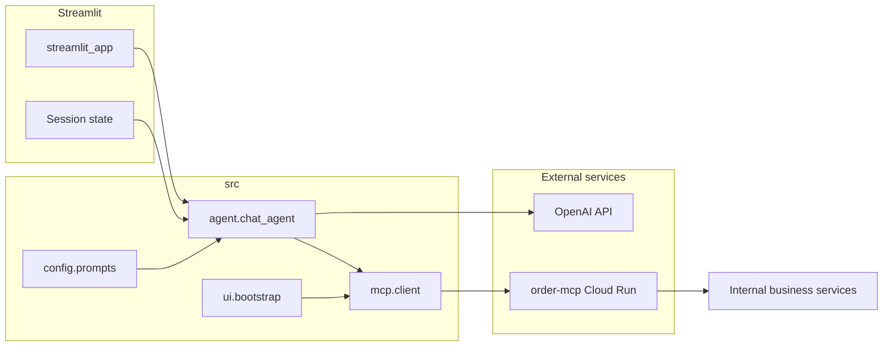

# Architecture

## High-level flow

- **Entry** (`app.py`): Delegates to `src.ui.streamlit_app.main`.
- **UI** (`src/ui/streamlit_app.py`): Chat transcript, sidebar **email + PIN + Verify** (calls `verify_customer_pin` via `OrderMCPClient` — secrets are **not** stored in `messages`). On success: `verified_customer_id`, display name, optional `list_orders` in an expander; one **synthetic user line** (no secrets) is appended so the model knows the session is verified. `error_presenter` maps exceptions to user-facing copy.
- **Bootstrap** (`src/ui/bootstrap.py`): Creates `OrderMCPClient` + OpenAI tool specs (no Streamlit dependency).
- **Agent** (`src/agent/chat_agent.py`): OpenAI tool loop; `enrich_product_tool_result` + `append_product_detail_formatting` on product tools; `augment_assistant_reply_with_icons` on final assistant text; `apply_verified_customer_scope` for `list_orders` / `create_order` when `verified_customer_id` is set; extracts customer id from `verify_customer_pin` tool text when that tool runs in the chat loop.
- **Supporting modules** (`src/agent/`): `tool_schema`, `tool_policy`, `messages`, `product_icon_enricher`, `product_detail_format`.
- **MCP** (`src/mcp/client.py`): JSON-RPC over HTTP — `initialize`, `notifications/initialized`, `tools/list`, `tools/call`; transport vs protocol errors.
- **Config** (`src/config/`): `settings`, `prompts`, `constants`, `category_icons`, `ui_icons`.

## Session and authentication

**Sidebar:** Users verify with email + PIN in the sidebar; successful verification sets `st.session_state.verified_customer_id` (and related display fields). A benign **user** message is appended once: *“I completed account verification for this session.”* so OpenAI sees verification without credentials in history.

**Agent path:** When the model calls `verify_customer_pin` inside the tool loop, the agent still parses the tool result and updates the in-memory `active_customer_id` for the rest of that turn. `list_orders` / `create_order` arguments are **scoped** to `verified_customer_id` from session when present.

## Error handling

- **HTTP / network / bad JSON** from MCP → `MCPConnectionError` (extends `MCPError`).
- **JSON-RPC or tool errors** from MCP → `MCPClientError` (extends `MCPError`).
- **OpenAI API failures** during completion → `LLMProviderError` (extends `MeridianBotError`).
- UI uses **`error_presenter`** so messages stay consistent and stack traces are not dumped to users.

## Security notes (prototype → production)

- API keys only via **HF Space secrets** or local `.env` (never committed).
- Prefer sidebar PIN entry over pasting secrets into chat.
- Add **audit logging** and stronger auth before real production.
