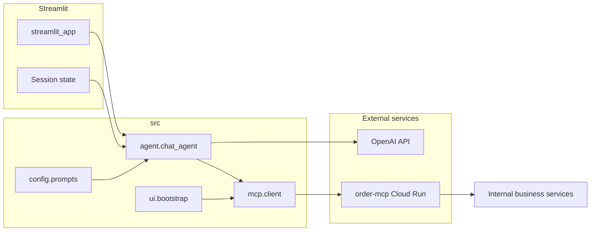

# Architecture

## High-level flow

- **Entry** (`app.py`): Delegates to `src.ui.streamlit_app.main`.
- **UI** (`src/ui/`): Layout, session keys, `st.cache_resource` bootstrap, `error_presenter` maps exceptions to copy.
- **Bootstrap** (`ui/bootstrap.py`): Creates `OrderMCPClient` + OpenAI tool specs (no Streamlit dependency).
- **Agent** (`src/agent/`): `chat_agent` (OpenAI loop), `tool_schema` (MCP→OpenAI tools), `tool_policy` (PIN scope + JSON args), `messages` (system prompt assembly).
- **MCP** (`src/mcp/client.py`): JSON-RPC over HTTP — `initialize`, `notifications/initialized`, `tools/list`, `tools/call`; transport errors vs protocol errors.
- **Config** (`src/config/`): `settings`, `prompts`, `constants`.

## Session and authentication

After a successful `verify_customer_pin` tool call, the app extracts a **customer UUID** from the tool result text and stores it in `st.session_state.verified_customer_id`. For `list_orders` and `create_order`, the agent **overrides** `customer_id` with this value when present, so the logged-in customer cannot accidentally act on another account.

## Error handling

- **HTTP / network / bad JSON** from MCP → `MCPConnectionError` (extends `MCPError`).
- **JSON-RPC or tool errors** from MCP → `MCPClientError` (extends `MCPError`).
- **OpenAI API failures** during completion → `LLMProviderError` (extends `MeridianBotError`).
- UI uses **`error_presenter`** so messages stay consistent and stack traces are not dumped to users.

## Security notes (prototype → production)

- API keys only via **HF Space secrets** or local `.env` (never committed).
- PIN and email travel over HTTPS to the app; the app calls MCP over HTTPS.
- Add **audit logging** and stricter auth before real production.
